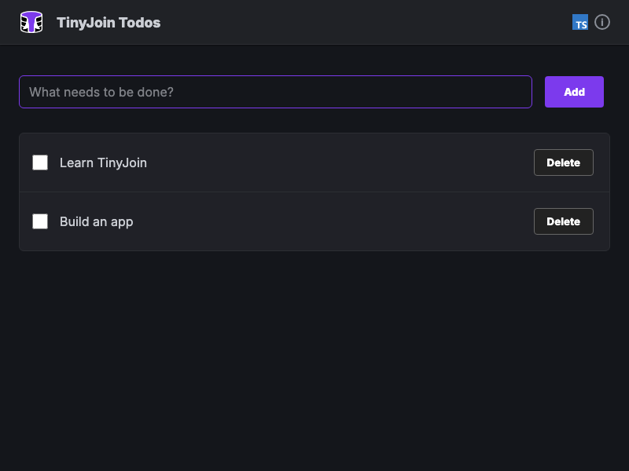

# create-tinyjoin

Scaffold a small local todo app with TinyJoin and Vite:

```sh
npm create tinyjoin@latest
```

The generated project is ready to run at its root and needs no database server,
account, or credentials. Choose TypeScript or JavaScript, and whether its todos
should remain after reloads or start fresh each time.

Your app should look something like this:



- Task list with add/complete/delete
- Single TinyJoin database with one `todos` table
- Demonstrates basic CRUD operations in SQL
- Perfect starter example

It shares its markup and styling with the equivalent
[create-tinybase](https://github.com/tinyplex/create-tinybase) vanilla
TypeScript starter, apart from the TinyJoin accent color.

For agents and CI, every option can be supplied non-interactively:

```sh
npm create tinyjoin@latest -- --non-interactive \
  --projectName my-tinyjoin-app \
  --language typescript \
  --storage opfs \
  --installAndRun false
```

Use `--list-options` for the machine-readable option catalog or `--help` for
usage.

`npm run build` assembles the publishable `create-tinyjoin` package under
`dist/`.

## Generated structure

The generated project is a single Vite application at its root (`.ts` below
becomes `.js` when JavaScript is chosen):

- `index.html` loads the app and defines its theme variables.
- `src/index.ts` bootstraps the app on load.
- `src/app.ts` builds the app shell, showing a spinner until the database opens.
- `src/database.ts` opens the database, defines the `todos` table, and adds the
  starter todos on the first visit.
- `src/todoInput.ts`, `src/todoList.ts`, and `src/todoItem.ts` are the todo
  interface, each with a colocated stylesheet.
- `src/topBar.ts`, `src/title.ts`, `src/info.ts`, `src/loading.ts`,
  `src/button.ts`, and `src/input.ts` are the shared interface pieces.

## TypeScript and JavaScript

The templates are written once, in TypeScript. Choosing JavaScript strips their
types with `ts-blank-space` and renames the outputs to `.js`, exactly as
`create-tinybase` does: `getFiles` marks each `.ts` template `transpile` when
the JavaScript language is chosen, and `tinycreate` blanks the types during
post-processing. A JavaScript project also drops `tsconfig.json`, the
`typescript` devDependency, and the `tsc --noEmit` step from its build script.

## Development

```sh
npm run typecheck       # generator and test TypeScript
npm test                # CLI, template, snapshot, and package-boundary tests
npm run test:generated  # generated apps against published TinyJoin
npm run test:e2e        # real generated-app behavior in Chromium
```

`npm test` compares every generated file, for both languages and both storage
modes, against the snapshots in `test/__snapshots__`. Run
`npx vitest run test/cli.test.ts -u` to accept intentional template changes.
`npm run test:generated` installs and builds all four combinations, and
`npm run test:e2e` then drives the two saved apps in Chromium.

Run the local generator from this repository's parent directory with:

```sh
npm --prefix create-tinyjoin run local
```

This builds only the generator. The generated app installs the published
TinyJoin package, so its native build toolchain is not required.

To test unpublished changes from a neighboring TinyJoin source repository, use:

```sh
npm --prefix create-tinyjoin run local:source
```

That command builds and packs the sibling TinyJoin repository before starting
the generator.
